<!-- ╔═══════════════════════════════════════════════════════════════╗
     ║            ✦ L E K H A N   H   R ✦                          ║
     ║    CS Student · Cloud & Blockchain · Space Aesthetic         ║
     ╚═══════════════════════════════════════════════════════════════╝ -->

<!-- 🌌 ANIMATED STARFIELD HEADER -->


<!-- 🪐 COSMIC HEADER BANNER — Deep space gradient -->


<div align="center">

<!-- ✨ Animated subtitle — cosmic typing effect -->
[](https://github.com/lekhanpro)

<br/>

<!-- 🔗 Profile badges — cosmic style -->
<a href="https://lekhan-portfolio.vercel.app"></a>
<a href="https://www.linkedin.com/in/lekhan-hr-507b89371"></a>


</div>

<br/>

<!-- 🐍 Snake Animation -->
<div align="center">
  <picture>
    <source media="(prefers-color-scheme: dark)" srcset="https://raw.githubusercontent.com/lekhanpro/lekhanpro/output/github-snake-dark.svg" />
    <source media="(prefers-color-scheme: light)" srcset="https://raw.githubusercontent.com/lekhanpro/lekhanpro/output/github-snake.svg" />
    
  </picture>
</div>

<!-- ✦ Star divider ✦ -->


<!-- ═══════════════════ ABOUT ME + STATS ═══════════════════ -->

<table>
<tr>
<td width="50%" valign="top">

##  Mission Log

```ts
const lekhan = {
  callsign: "lekhanpro",
  pronouns: "he" | "him",
  base: "Bengaluru, India",

  education: {
    degree: "B.E. Computer Science",
    status: "Undergraduate Student"
  },

  mission: [
    "Cloud Computing Engineer",
    "Blockchain Developer",
    "Distributed Systems Architect"
  ],

  currentRoles: [
    "CS Engineering Student",
    "Full-Stack Developer",
    "AI/ML Explorer",
    "Open Source Contributor",
    "GSoC Aspirant"
  ],

  activeMissions: [
    "Edge AI Android Apps",
    "Chess AI Analyst (Stockfish)",
    "Cloud-Native Microservices",
    "Developer Portfolio"
  ],

  trainingModules: [
    "AWS / GCP / Azure",
    "Solidity & Smart Contracts",
    "Kubernetes & Docker",
    "System Design",
    "Data Science"
  ],

  commsChannel: [
    "React & Next.js", "TypeScript",
    "Python", "Node.js", "Edge AI",
    "Cloud Architecture", "Web3"
  ],

  funFact: "I build AI that runs offline"
};
```

</td>
<td width="50%" valign="top">

##  Orbital Metrics


</td>
</tr>
</table>

<!-- ✦ Star divider ✦ -->


<!-- ═══════════════════ SOLAR SYSTEM + TECH ═══════════════════ -->

<div align="center">

##  Tech Constellation

<!-- 🪐 Animated Solar System -->


</div>

<div align="center">

**`🌟 Languages`**


<br/>

**`🔭 Frontend & Frameworks`**


<br/><br/>

**`🛰️ Backend & Runtime`**


<br/><br/>

**`☁️ Cloud & DevOps`**


<br/><br/>

**`🔗 Blockchain & Web3`**


<br/>

**`🗄️ Databases`**


<br/><br/>

**`🧠 AI / ML`**


<br/><br/>

**`🛠️ Tools & Platforms`**


</div>

<!-- ✦ Star divider ✦ -->


<!-- ═══════════════════ FEATURED PROJECTS ═══════════════════ -->

## <div align="center"> Space Station Projects</div>

<table>
<tr>
<td align="center" width="33%">

<br/><br/>
<b>Chess Post-Game Analyst</b>
<br/>
<sub>Stockfish-powered AI game analysis with mistake detection & coaching</sub>
<br/><br/>
<a href="https://github.com/lekhanpro/chess-post-game-analyst"></a>


</td>
<td align="center" width="33%">

<br/><br/>
<b>Edge AI Android</b>
<br/>
<sub>AI models running locally on mobile — no cloud needed</sub>
<br/><br/>
<a href="https://github.com/lekhanpro/edge-ai-android"></a>


</td>
<td align="center" width="33%">

<br/><br/>
<b>CodeGuard</b>
<br/>
<sub>Automated code security analysis & vulnerability detection</sub>
<br/><br/>
<a href="https://github.com/lekhanpro/CodeGuard"></a>


</td>
</tr>
<tr>
<td align="center" width="33%">

<br/><br/>
<b>SpendWise v2</b>
<br/>
<sub>Smart money management with analytics & budget tracking</sub>
<br/><br/>
<a href="https://github.com/lekhanpro/spendwisev2"></a>


</td>
<td align="center" width="33%">

<br/><br/>
<b>Chaos Dock</b>
<br/>
<sub>Container chaos engineering toolkit built in Go</sub>
<br/><br/>
<a href="https://github.com/lekhanpro/chaos-dock"></a>


</td>
<td align="center" width="33%">

<br/><br/>
<b>Lekhan Portfolio</b>
<br/>
<sub>React 19 + Vite 7 + Tailwind CSS 4 — deployed on Vercel</sub>
<br/><br/>
<a href="https://github.com/lekhanpro/lekhan-portfolio"></a>


</td>
</tr>
</table>

<!-- ✦ Star divider ✦ -->


<!-- ═══════════════════ ANALYTICS & METRICS ═══════════════════ -->

## <div align="center"> Telemetry Dashboard</div>

<div align="center">

<!-- Activity Graph -->


</div>

<br/>

<div align="center">

<!-- Profile Summary Cards -->


</div>

<div align="center">


</div>

<br/>

<div align="center">

<!-- GitHub Trophies -->


</div>

<br/>

<div align="center">

<!-- Contributor Stats -->


</div>

<details>
<summary><b>📡 Extended Telemetry</b></summary>
<br/>

<div align="center">


<br/><br/>


</div>

</details>

<!-- ✦ Star divider ✦ -->


<!-- ═══════════════════ LEARNING ROADMAP ═══════════════════ -->

## <div align="center"> Flight Plan — 2025-2026</div>

<div align="center">

```
  ╔══════════════════════════════════════════════════════════════════╗
  ║                  🚀 MISSION TRAJECTORY                          ║
  ╠══════════════════════════════════════════════════════════════════╣
  ║                                                                  ║
  ║  ☁️  CLOUD COMPUTING                                             ║
  ║  ├── AWS Solutions Architect Certification                       ║
  ║  ├── Google Cloud Professional Track                             ║
  ║  ├── Kubernetes & Container Orchestration                        ║
  ║  ├── Serverless Architecture (Lambda, Cloud Functions)           ║
  ║  └── Infrastructure as Code (Terraform, Pulumi)                  ║
  ║                                                                  ║
  ║  🔗  BLOCKCHAIN & WEB3                                           ║
  ║  ├── Solidity & Smart Contract Development                       ║
  ║  ├── Ethereum & EVM-compatible Chains                            ║
  ║  ├── DeFi Protocols & dApp Architecture                          ║
  ║  ├── IPFS & Decentralized Storage                                ║
  ║  └── Zero-Knowledge Proofs & Layer 2 Scaling                     ║
  ║                                                                  ║
  ║  🏗️  SYSTEM DESIGN                                               ║
  ║  ├── Distributed Systems & Microservices                         ║
  ║  ├── Event-Driven Architecture (Kafka, RabbitMQ)                 ║
  ║  ├── Database Sharding & Replication                             ║
  ║  └── High Availability & Fault Tolerance                         ║
  ║                                                                  ║
  ╚══════════════════════════════════════════════════════════════════╝
```

</div>

<!-- ✦ Star divider ✦ -->


<!-- ═══════════════════ CONNECT ═══════════════════ -->

## <div align="center"> Open a Comm Channel</div>

<div align="center">

<a href="https://lekhan-portfolio.vercel.app"></a>
<a href="mailto:lekhanhr@gmail.com"></a>
<a href="https://orcid.org/0009-0006-3550-8594"></a>

<br/><br/>

<a href="https://github.com/lekhanpro"></a>
<a href="https://www.linkedin.com/in/lekhan-hr-507b89371"></a>
<a href="https://x.com/lekhu4405"></a>
<a href="https://instagram.com/little_scientist_07"></a>

</div>

<!-- ✦ Star divider ✦ -->


<div align="center">


<br/><br/>

** Thanks for visiting my corner of the universe!**

</div>

<!-- 🌌 FOOTER — cosmic gradient wave -->

